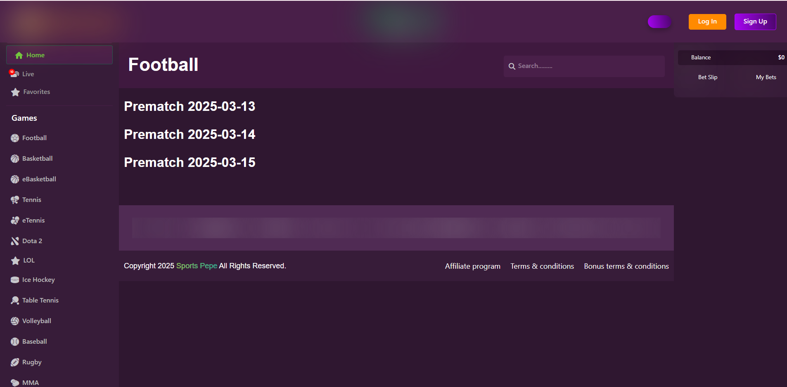
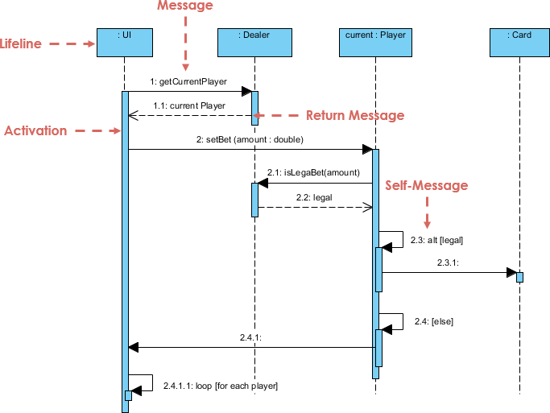

# Sports Betting Platform
==========================

A cutting-edge sports betting platform designed to provide users with a seamless and secure betting experience across various sports.

## Overview
--------

This platform integrates blockchain technology to ensure transparency and security in all transactions. It offers real-time updates, AI-driven analytics, and a user-friendly interface for placing bets.

## Features
--------

- **Blockchain Integration**: Ensures transparent and secure transactions.
- **Smart Contracts**: Automate betting rules and payouts.
- **AI-Powered Analytics**: Provides real-time insights and predictions.
- **Responsive Design**: Optimized for desktop and mobile devices.
- **Multi-Sport Support**: Includes football, basketball, soccer, and more.

## Technology Stack
-----------------

- **Frontend**: Built with **React** for cross-platform compatibility.
- **Backend**: Utilizes **Node.js** for robust server-side logic.
- **Database**: **MongoDB** or **MySQL** for efficient data management.
- **Blockchain**: Integrated with **Ethereum**, **Solana**, or other compatible chains.

## Setup
-------

1. **Clone the Repository**: git clone https://github.com/yourusername/sports-betting-platform.git

2. **Install Dependencies**:
npm install

3. **Start the Application**:
npm start

## Contributing
------------

Contributions are welcome! Please submit pull requests with detailed explanations of changes.

## Contact me
--------------

For inquiries or custom development requests, please contact me.

[Telegram](https://t.me/CodeX2124)
[Discord](https://discord.com/users/codex_2124)

